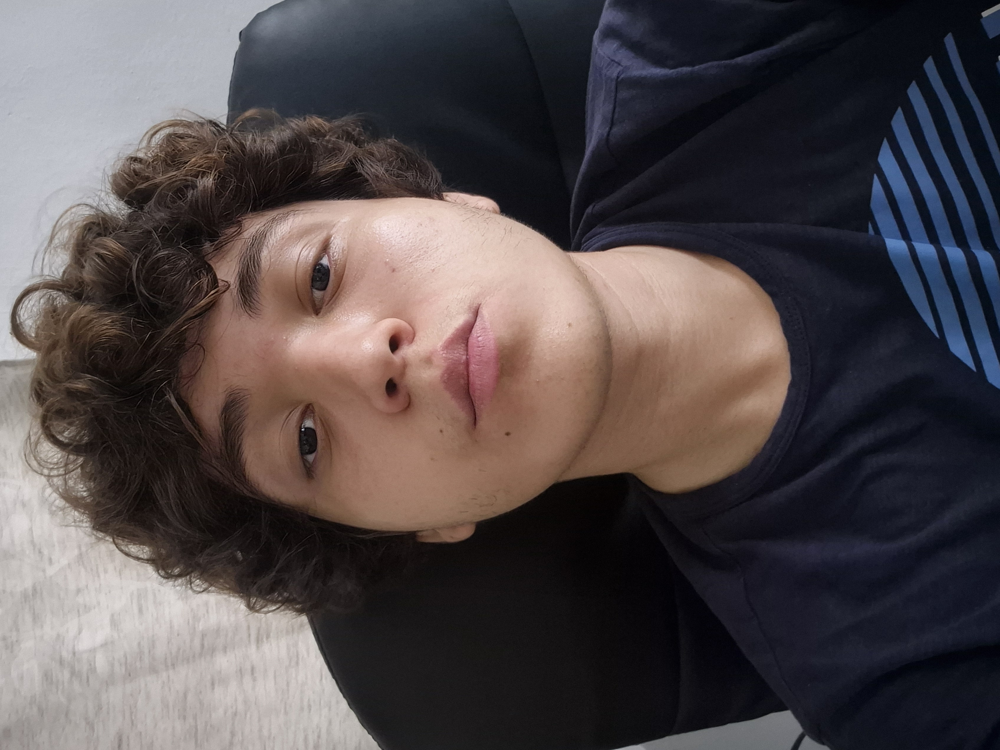
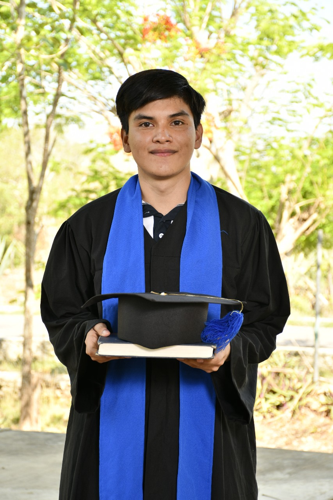
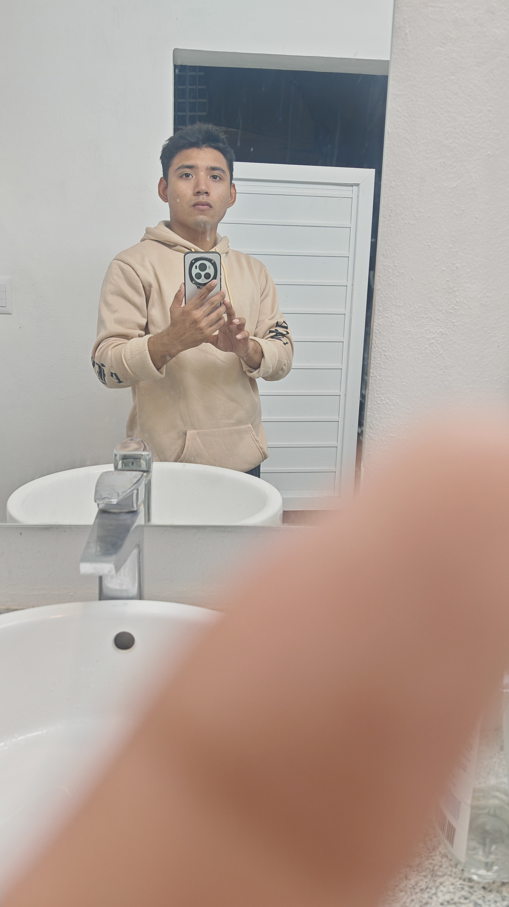

**Equipo 7 - Fundamentos de Ingeniería de Software**

Proyecto: Mapa virtual interactivo e informativo de la Facultad de Matemáticas de la UADY.

[Producto](Entrega%203/Producto)

[Descripción del proceso](Entrega%203/Proceso/Descripción%20del%20proceso.md)

[Gestión del proceso](Entrega%203/Proceso/Gestión%20de%20proceso.md)

[Bitácoras](Entrega%203/Proceso/Bitácoras)

[Requisitos Funcionales](Entrega%203/Requisitos/Priorización%20Requisitos%20Funcionales.md)

[Requisitos no funcionales](Entrega%203/Requisitos/Priorización%20Requisitos%20No%20Funcionales.md)

[Historias de usuario](Entrega%203/Requisitos/Historias%20de%20usuario.md)

[Pruebas](Entrega%203/Pruebas)

[Competencias genéricas y específicas](Entrega%203/Competencias%20genéricas%20y%20específicas.md)

[Métrica FINAL de contribución individual](Entrega%203/Proceso/Métrica%20FINAL%20de%20contribución%20individual.md)

[Métrica de contribución individual Entrega 3](Entrega%203/Proceso/Métrica%20de%20contribución%20individual%20Entrega%203.md)

***Integrantes del equipo (roles actualizados de acuerdo a Scrum):***

* Matú Leonardo (Desarrollador)
* Palma Leonardo (Desarrollador)
* Padilla Germán (Product Owner)
* Pool Juan (Desarrollador)
* Trujeque Isaac (Desarrollador)
* Vivanco Josué (Scrum Master)

| Integrante | Descripción y rol en el proyecto |
|-------------|----------------------------------|
|Josue Vivanco          |Scrum Master                                  |
|Juan Poot      |      Desarrollador                               |
|Germán Padilla              |Product Owner                                  |
|Isaac Alejandro Trujeque Martin |Desarrollador|
|Leonardo Palma Coll              |  desarrollador   |
|Leonardo Daniel Matú              |  desarrollador   |