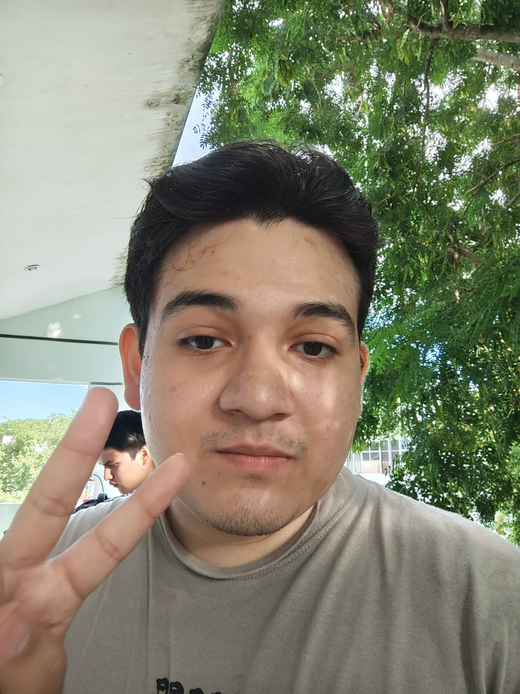
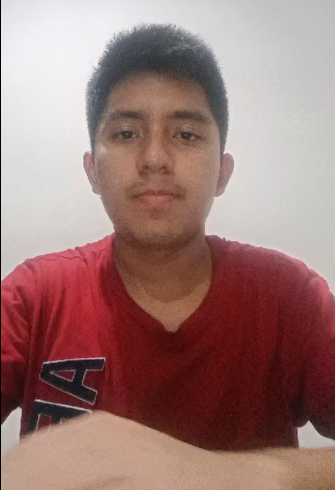

**Equipo 7 - Fundamentos de Ingeniería de Software**

Proyecto: Mapa virtual interactivo e informativo de la Facultad de Matemáticas de la UADY.

***Integrantes del equipo (roles actualizados de acuerdo a Scrum):***

* Matú Leonardo (Desarrollador)
* Palma Leonardo (Desarrollador)
* Padilla Germán (Product Owner)
* Pool Juan (Desarrollador)
* Trujeque Isaac (Desarrollador)
* Vivanco Josué (Scrum Master)

| Integrante | Descripción y rol en el proyecto |
|-------------|---------------------------------|
|Germán Padilla              |Product Owner                                  |
|Isaac Alejandro Trujeque Martin |Desarrollador|
|Leonardo Palma Coll              |  desarrollador   |

[Producto](Entrega%201/Producto)

[Video Presentación](Entrega%201/VIDEO%20PRESENTACIÓN.MD)

[Proceso](Entrega%201/Proceso)

[Requisitos](Entrega%201/Requisitos)

[Historias de usuario](Entrega%201/Historias.md)

[Competencias genéricas](Entrega%201/Competencias%20genéricas.md)

[Competencias específicas](Entrega%201/Competencias%20específicas.md)

